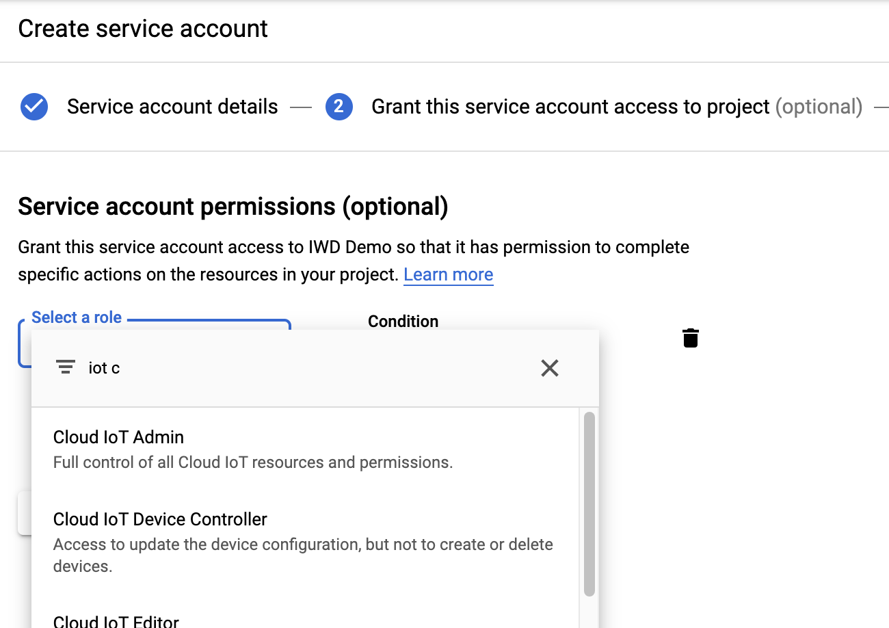
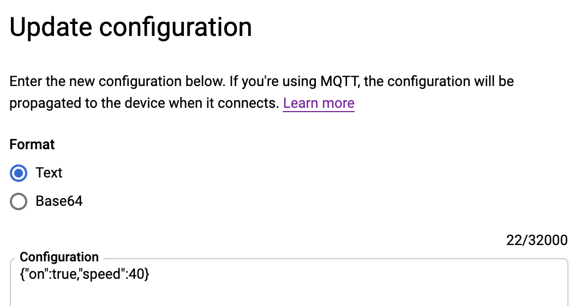

# Updating Cloud IoT Core Config with Google Cloud functions (in Go)

Google Cloud IoT Core is a service that easily and securely connects and manages IoT devices. Cloud IoT Core handles the connection and authentication of devices so that developers can focus on sending and receiving data from the devices.

In this article, we will configure devices using Google Cloud IoT Core’s Go SDK. Then, we will wrap the code in a Google Cloud Function so that it can be deployed and run in a scalable way.

You can find the full code [here](https://github.com/xinyinglim/articles/tree/master/cloudfunc-iotcore/cloudfunc.go).

Note: Cloud IoT Core uses billable components of Google Cloud Platform. For small projects you should be able to stay within the free tier.

# Before you start

There are two definitions for Cloud IoT Core that you should know:
- Device : the actual physical devices that you want to connect to IoT Core. They are connected to the Internet and can send and receive data.
- Registry : A logical grouping of devices in IoT Core. Each device belongs to a registry.

Before starting, make sure you have created at least one registry and device on Cloud IoT Core. You can follow the instructions [here](https://cloud.google.com/iot/docs/how-tos/devices).

Note down:
- Your GCP Project ID
- Registry ID
- Registry Location (selected when you created the registry)
- Device ID

# Install the cloudiot package

```
$	go get google.golang.org/api/cloudiot/v1
``` 

# Building the Function

First, set imports.

```go
import (
	"context"
	b64 "encoding/base64"
	"encoding/json"

	cloudiot "google.golang.org/api/cloudiot/v1"
)	

```

Next, create a client.

```go
ctx := context.Background()
service, err := cloudiot.NewService(ctx)

```

Get device service.
```go
deviceService := cloudiot.NewProjectsLocationsRegistriesDevicesService(service)
```

Prepare the message you want to send. 

Let's say the your IoT device is a fan and you need to remotely control it. We make the fan accept two parameters: on/off and the desired speed of the fan.
```json
{ "on" : true, "speed" : 40}
```
For example, if the weather is hot, you can send a configuration to switch on the fan at the highest speed.

For convenience, let's write a struct to contain the setting.

```go
type FanConfig struct {
	On    bool `json:"on"`
	Speed int  `json:"speed"`
}
```

Create an instance of the configuration.

```go
sunnyConfigData := FanConfig{
    On : true,
    Speed: 40,
}
```

You will need to encode it to base 64. 

```go
bytes, err := json.Marshal(sunnyConfigData)
if err != nil {
    //handle error
}

encodedString := b64.StdEncoding.EncodeToString(bytes)
```

Create a Config Request from the encoded data.
```go
configRequest := cloudiot.ModifyCloudToDeviceConfigRequest{
	BinaryData: encodedString,
}
```
Now that you have built the configuration request, you will need to decide where to send it to.

In Cloud IoT Core, devices are grouped in registries. To send configuration data to a specific device, you will need the registry name and device ID.

Note: You should have already created a registry, a device and their corresponding public-private key pairs. You can find a tutorial [here](https://cloud.google.com/iot/docs/how-tos/devices).

Initialize the following values:

```go
projectID   := <YOUR-GCP-PROJECT-ID>
location    := <REGISTRY-LOCATION>
registryID  := <REGISTRY-ID>
deviceID    := <DEVICE-ID>
```
Registry location can be set when you created your registry.

The device path is in the following format.
```go
devicePath := fmt.Sprintf("projects/%s/locations/%s/registries/%s/devices/%s", projectID, location, registryID, deviceID)
```
Now you have the device path and the Config Request.

Send the request to the device by calling the Config Request
```go
call := deviceService.ModifyCloudToDeviceConfig( devicePath, &configRequest)

call.Context(ctx)

_, err = call.Do()
```

Here's the code so far:

```go
package main

import (
	"context"
	b64 "encoding/base64"
	"encoding/json"
	"fmt"

	cloudiot "google.golang.org/api/cloudiot/v1"
)

type FanConfig struct {
	On    bool `json:"on"`
	Speed int  `json:"speed"`
}

func main() {
	ctx := context.Background()
	service, err := cloudiot.NewService(ctx)
	if err != nil {
		fmt.Printf("%v\n", err)
		return
	}
	deviceService := cloudiot.NewProjectsLocationsRegistriesDevicesService(service)
	sunnyConfigData := FanConfig{
		On:    true,
		Speed: 40,
	}
	bytes, err := json.Marshal(sunnyConfigData)
	if err != nil {
		fmt.Printf("%v\n", err)
		return
	}

	encodedString := b64.StdEncoding.EncodeToString(bytes)
	configRequest := cloudiot.ModifyCloudToDeviceConfigRequest{
		BinaryData: encodedString,
	}

	projectID := "YOUR-GCP-PROJECT-ID"
	location := "REGISTRY-LOCATION"
	registryID := "REGISTRY-ID"
    deviceID := "DEVICE-ID"
    

	devicePath := fmt.Sprintf("projects/%s/locations/%s/registries/%s/devices/%s", projectID, location, registryID, deviceID)
	call := deviceService.ModifyCloudToDeviceConfig(devicePath, &configRequest)
	call.Context(ctx)

	_, err = call.Do()
	if err != nil {
		fmt.Printf("%v\n", err)
	}

}

```
# Running the function locally

To run the code locally, you will need credentials to a service account with the correct IoT Core permissions. 

Go to the [GCP Cloud Console](console.cloud.google.com) > IAM & Admin > Service Accounts. Create a service account with the "Cloud IoT Device Controller permission". This allows the service account to change device configurations.



Create a JSON key, save it locally and set the environmental variable GOOGLE_APPLICATION_CREDENTIALS to the key's file path using your terminal.

```
export GOOGLE_APPLICATION_CREDENTIALS="/path/to/key.json"
```
You can run the code.
```
$ go run main.go
```

To check if successful, you can go to the [Cloud Console](console.cloud.google.com) > IoT Core > Devices. Select your device and click the "Update Config" button.


You will see your current configuration in the text box.



You can also change device configuration here, directly from the console, but when you have many devices, it's more scalable to do it programmatically.

# Convert to Cloud Function and Deploy

Now that you have tested the code locally, you can deploy it to Cloud Functions for production use.

# Writing the Cloud Function

Google Cloud Functions are serverless functions that will run snippets of code. Google handles the underlying infrastructure and will scale up instances as needed.

For this example, we will send an HTTP Request to trigger the Cloud Function. The function then takes the configuration information from the body of the request, converts it to a ConfigRequest and sends it to IoT Core to configure the physical devices.

Create a go module.

```
$   export GO111MODULE=on
$   go mod init
$   go mod tidy
```

Here's the full code for the Cloud Function. It's similar to the earlier code. This code updates the config of a single device, but you can modify it to handle more devices.
```go
package main

import (
	"context"
	b64 "encoding/base64"
	"encoding/json"
	"fmt"
	"net/http"

	cloudiot "google.golang.org/api/cloudiot/v1"
)

type FanConfig struct {
    On    bool `json:"on"`
    Speed int  `json:"speed"`
}

func UpdateWeather(w http.ResponseWriter, r *http.Request) {
	ctx := context.Background()
	service, err := cloudiot.NewService(ctx)
	if err != nil {
		fmt.Printf("%v\n", err)
		return
	}
	deviceService := cloudiot.NewProjectsLocationsRegistriesDevicesService(service)
	sunnyConfigData := FanConfig{
		On:    true,
		Speed: 20,
	}
	bytes, err := json.Marshal(sunnyConfigData)
	if err != nil {
		fmt.Printf("%v\n", err)
		return
	}

	encodedString := b64.StdEncoding.EncodeToString(bytes)
	configRequest := cloudiot.ModifyCloudToDeviceConfigRequest{
		BinaryData: encodedString,
	}

	projectID := "YOUR-GCP-PROJECT-ID"
	location := "REGISTRY-LOCATION"
	registryID := "REGISTRY-ID"
    deviceID := "DEVICE-ID"

	devicePath := fmt.Sprintf("projects/%s/locations/%s/registries/%s/devices/%s", projectID, location, registryID, deviceID)
	call := deviceService.ModifyCloudToDeviceConfig(devicePath, &configRequest)
	call.Context(ctx)

	_, err = call.Do()
	if err != nil {
		fmt.Printf("%v\n", err)
		w.WriteHeader(http.StatusInternalServerError)
		w.Write([]byte("500 - Something bad happened!"))
		return
	}
	w.WriteHeader(http.StatusOK)
	w.Write([]byte("Success!"))
}
```

You can modify the code to pass in configuration data through the *http.Request object.

To check that the function works as intended, you can deploy it with
```
$	gcloud functions deploy UpdateWeather --runtime go111 --trigger-http --allow-unauthenticated
```
Upon successful deployment, you will get a url that you can use to call the function. Call the function and check that the configuration of the device has been updated. You can check using Cloud Console, as shown earlier. 

You will notice that the configuration has changed.

Warning: The allow-unauthenticated tag permits anyone with the url to call the function without requiring authentication. For production use, you should implement authentication. One way of securing the Cloud Function is by using [Google Cloud Endpoints](https://cloud.google.com/endpoints/docs/openapi/get-started-cloud-functions).

You can find the official documentation for Google Cloud IoT Core SDK [here](https://pkg.go.dev/google.golang.org/api/cloudiot/v1?tab=doc)
